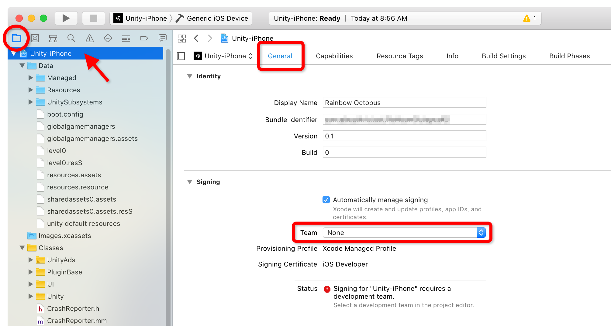

# Rainbow Octopus

In this Code Pattern, we will build an Octopus in Unity, which we deploy into an AR environment on an iPhone/iPad using ARKit. We can talk to the Octopus using IBM **Speech To Text**, **Tone Analyzer**, and **Watson Assistant**, and it will respond in various ways. 


When the reader has completed this Code Pattern, they will understand how to:

* Integrate the Watson Unity SDK into a project using the Unity Asset Store.
* Capture and send speech to the IBM Speech To Text, and interpret the results using Tone Analyzer and Watson Assistant.


<!--

Video goes here.

-->


## User Flow

1. User starts the app on iPhone or iPad.
2. ARKit identifies horizontal surfaces within the camera view and displays an AR placement indicator when it finds one.
3. The user taps the screen to place the octopus at the indicated position.
4. The app listens for speech. The user talks to the Octopus, saying things such as :
  * *"Hello! "* – Octopus will wave
  * *"Go for a walk"* – Octopus will start walking
  * *"Stop!"* – Octopus will get scared - changing colour to yellow - and stop in his tracks
  * *"Jump for Joy"* – Octopus will jump up and down, whilst glowing green
  * *"Turn right / left"* – Octopus will turn in the indicated direction
  * *"Get bigger / smaller"* – Octopus will grow / shrink
  * A variety of other emotive sentences that cause the Octopus to change colour. Reinforcing that emotion will make that colour become stronger.
5. The app sends the speech to Watson Speech-To-Text (via the Watson Unity SDK), and receives raw text in response.
6. The app passes the raw text to Watson Assistant and simultaneously to Watson Tone Analyzer – again utilizing the Watson Unity SDK.
7. The results from the Tone Analyzer determine what tone was identified from the stated speech – this may be "joy", "sadness", "anger" etc. – and colours the octopus accordingly. 
8. The intent from the results of the Watson Assistant are also analyzed and may cause the octopus to walk, jump, get bigger or smaller, etc.


## Demonstrated Components

**[Watson Assistant](https://www.ibm.com/watson/services/conversation/)**

Create a chatbot with a program that conducts a conversation via auditory or textual methods.

**[Watson Speech-to-Text](https://www.ibm.com/watson/services/speech-to-text/)**

Easily convert audio and voice into written text for quick understanding of content. 

**[Watson Tone Analyzer](https://www.ibm.com/watson/services/tone-analyzer/)**

Understand emotions and communication style in text. 

**[IBM Watson SDK for Unity](https://assetstore.unity.com/ibm)**

Use this SDK to build Watson-powered applications in Unity.

[**Unity's AR Foundation and ARKit XR Plugin packages**](https://blogs.unity3d.com/2018/06/15/multi-platform-handheld-ar-in-2018-part-1/)

Unity's latest enabling technology for creating cross-platform handheld AR applications.


## Prerequisites


Before attempting to get the project running, ensure the following pre-requisites have been met:

- You have a Mac (required for iOS builds)
- You have installed the proper tools and credentials to create iOS apps. See the [Unity iOS documentation](https://docs.unity3d.com/Manual/iphone-GettingStarted.html) for full details.
- You are using Unity 2018.2. This project has been tested on Unity 2018.2.3 specifically.


# Steps


## Run locally

To run locally you will perform these steps. Read on for a full description of each step.

1. Clone this repository
1. Create Watson services with IBM Cloud
1. Import the Watson Assistant workspace
1. Add the IBM Watson SDK to the Unity project
1. Add credentials to Unity
1. Export an Xcode build from Unity
1. Build and run from Xcode


### 1. Clone this repository

Clone the `RainbowOctopus` repo locally. In a terminal, run:

```
$ git clone https://github.com/kevinxbrown/RainbowOctopus.git
```
(If you open this project in Unity now, without completing the other steps below, you will see errors in the console.)


### 2. Create Watson services with IBM Cloud

> Note: In order to proceed with the following steps you will need to [register for a free IBM Cloud account](https://console.bluemix.net/registration/). The free, "Lite" versions of each service mentioned below will work for the purposes of this code pattern.

Create the [Watson Assistant](https://console.ng.bluemix.net/catalog/services/conversation) service by providing a name of your choice and clicking the **"Create"** button at the bottom of the screen.

Once created, you'll see either the credentials for *username* and *password* or an IAM *apikey*, either of which you should copy down to be used later. (Click the **"Show"** link to expose them).


Repeat for [Watson Tone Analyzer](https://console.bluemix.net/catalog/services/tone-analyzer), taking note of the *username* and *password*.

Repeat for [Watson Speech To Text](https://console.bluemix.net/catalog/services/speech-to-text), again taking note of the *username* and *password*.


### 3. Import the Watson Assistant workspace

Return to the [IBM Cloud Dashboard](https://console.bluemix.net/dashboard/apps) and click on the Watson Assistant service instance you created above. *Hint: if you ever get lost in the IBM Cloud interface, clicking on the **"IBM Cloud"** logo will always return you to the Dashboard.*

From the Watson Assistant service screen, click the **"Launch tool"** button, then click the **"Workspaces"** tab. 

Import the workspace definition file we've provided by clicking the upload icon, selecting the `/RainbowOctopusWatsonAssistantSample.json` file from the root directory of this project, and clicking the **"Import"** button.


After the upload completes, the workspace will automatically open in edit mode. No changes should be made! Click the **"Workspaces"** link at the top of the page to return to the Workspaces screen.

From the Workspaces screen, click the three vertical dots on the "Rainbow Octopus Example" card and choose **"View Details"**.


 Take note of the Workspace ID and save this for later.


### 4. Add the IBM Watson SDK to the Unity project

Open the Unity project. Don't be alarmed by the errors you see printed in the Console. We'll fix these by importing the IBM Watson SDK for Unity.

From within Unity, open the Asset Store panel and search for the IBM Watson SDK for Unity. Download and then import the SDK into the project. After import, all console errors should disappear.

> *Note:* This project has been tested with version 2.7.0 of the Watson SDK.


### 5. Add credentials to Unity

Open the main scene for the project: `Assets/RainbowOctopus/Scenes/RainbowOctopus`

In the Hierarchy panel, select the `OctopusController` game object. In the Inspector, you will see all the scripts that handle the services. Place the `Username` and `Password` for each service in the relevant script's settings panel. 

> *Reminder:* You saved the Username and Password values in [step #2](#2. Create Watson services with IBM Cloud).

In the Conversation Handler (Script) section you'll also see the `Workspace Id` field. Update this with your Watson Assistant workspace ID.

>  *Reminder:* You saved the Watson Assistant workspace ID in [step #3](#3. Import the Watson Assistant workspace).

Finally, keep the version dates configured as 2017-05-26 for Tone Handler and 2017-05-25 for Conversation Handler. These are the versions of the APIs which return data in the format our code is expecting.


### 6. Export an Xcode build from Unity
The first step of building a Unity project for iOS is to generate an Xcode project. Before you do this you will need to change the app's bundle identifier to a value that is unique to you following these steps...

1. Open the Build Settings window by selecting **File > Build Settings...**.
2. Select "iOS" as the Platform, and then click the **"Player Settings…"** button at the bottom of the window.
3. Open the Build Settings window again if you closed it, ensure "iOS" is selected as the platform, and click the **"Build"** button, saving the build wherever you'd like.


### 7. Build and run from Xcode

Before you can build and run the app from Xcode, you will have to tell Xcode which developer credentials to use when signing the app. Follow these steps...

1. Locate and open the Xcode project you saved above. It will be called `Unity-iPhone.xcodeproj`.
2. In the left panel, ensure that you have the Project Navigator view selected and click the top-level project icon labeled `Unity-iPhone`.
3. In the middle pane, ensure you have the **"General"** tab selected, the locate the "Signing" section. Select your developer profile from the "Team" menu.




Now you're ready to build and deploy the app...

1. Connect your iOS device to your computer.
2. In the Xcode header, change the target device from `Generic iOS Device` to the iOS device you just connected.
3. Click the **"Build and Run"** button (looks like a "play" icon.)

> **Alert:** In our testing we've noticed the initial build can sometimes fail at this point. If this happens, dismiss any windows that may appear and follow the remedy in the [Troubleshooting](#Troubleshooting) section below.

> Note: If you've used an enterprise developer account to sign the app, you may have to tell your iOS device to trust the developer account. You'll find this setting on your iOS device under **Settings > General > Profiles & Device Management**.


# Troubleshooting

**Problem:**

Xcode build fails with a "Apple Mach-O Linker (Id) Error".

**Potential Solution:**

1. Quit Xcode.
2. Delete the Xcode project folder you generated from Unity.
3. Re-try the steps outlined in [6. Export an Xcode build from Unity](#6. Export an Xcode build from Unity).


# Learn more

* **Artificial Intelligence Code Patterns**: Enjoyed this Code Pattern? Check out our other [AI Code Patterns](https://developer.ibm.com/code/technologies/artificial-intelligence/).
* **AI and Data Code Pattern Playlist**: Bookmark our [playlist](https://www.youtube.com/playlist?list=PLzUbsvIyrNfknNewObx5N7uGZ5FKH0Fde) with all of our Code Pattern videos
* **With Watson**: Want to take your Watson app to the next level? Looking to utilize Watson Brand assets? [Join the With Watson program](https://www.ibm.com/watson/with-watson/) to leverage exclusive brand, marketing, and tech resources to amplify and accelerate your Watson embedded commercial solution.


# License

This library is licensed under Apache 2.0. Full license text is available in [LICENSE](LICENSE).

The "Newport Loft" HDRi image is from www.hdrlabs.com and licensed under the Creative Commons Attribution-Noncommercial-Share Alike 3.0 License.